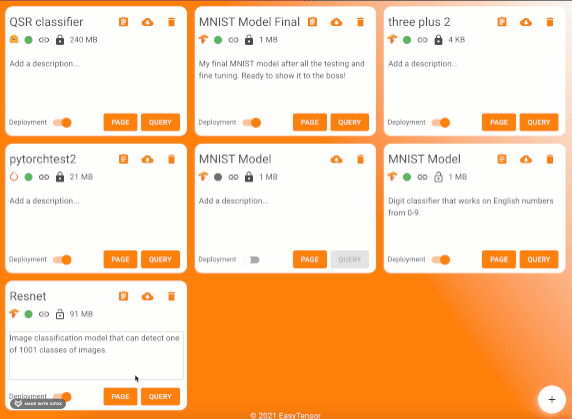
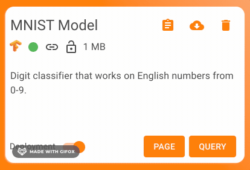

Every github repository has a README, and now every EasyTensor model has a page!

Model pages are meant to be a landing spot for your model. You can use pages in a variety of ways; here are a few that we've heard from our developers:

- Explain how your model works
- Document your model architecture
- Demo the model with sample use cases

---

# Online Editor

The model page runs on Markdown and can only be edited by the model's author. To edit the model page, click on `Page` button on the model card and click `Edit`.

---

# Visibility

Only you can view your model's page if it's private. When the time comes to share it to the world, make the model public and the page will be visible to everyone via the URL link.

