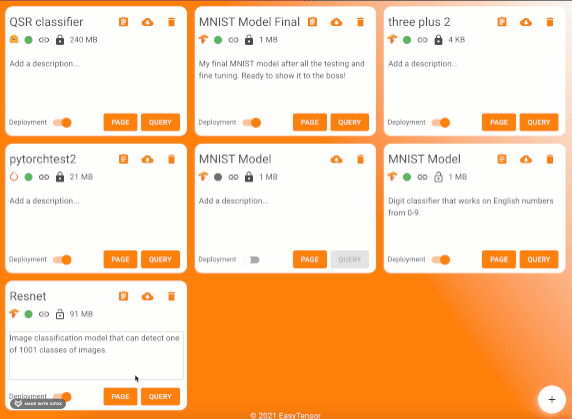

Hello and welcome to our second newsletter.

There is a bag of updates in today's issue, so let's get right to it!

---

# 🤗 Transformers support

Hugging Face (🤗) is one of the hottest NLP libraries out there, and they've been growing day by day. Our developers have been asking for an easy way to deploy hugging face models, and we're happy to help them out!

You can now easily deploy your finetuned hugging face models to EasyTensor and enjoy all the great features that come along with using ET.



---

# [Server Logs]()

Our main goal at EasyTensor is to make it easier for engineers to deploy their models to the cloud. But once you deploy your model, you might want to know what's going on under the hood. That's why we've added the ability to view the server logs on which your model is running. While we don't expect users to need to view their logs often, we understand that all engineers like to peek under the hood at any point in time.



---

# [Model Pages]()

Models now have their own page! Whether to explain its architecture, document how it works, or just demo a few use cases, you can now utilize this page as a landing page for anyone interested in your model.

